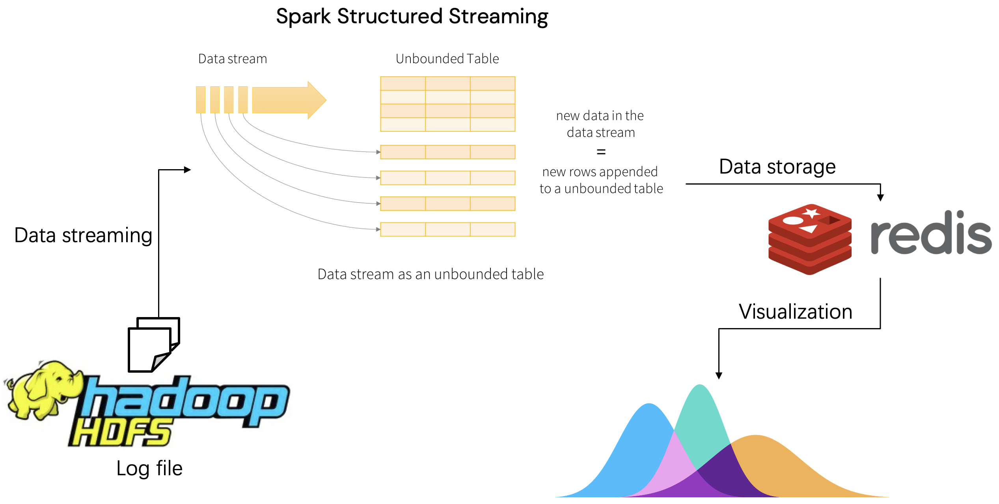

# SparkStreamingHomework

一个SparkStreaming作业，使用Hadoop、Spark、Redis、Matplotlib等工具，对流式数据进行处理。
1. 从Hadoop HDFS中读取log并在端口9876上开启数据服务器，模拟流式数据
2. 使用Spark Structured Streaming读取并计算窗口时间内数据的标准差，存到redis中
3. 从redis中取数，使用mattplotlib绘制图像，横坐标为时间，纵坐标为标准差，如果标准差>m，则认为数据波动过大，存在异常

Overview:

在本目录下载：
```bash
# jdk-8u202-linux-x64.tar.gz from: https://www.oracle.com/java/technologies/javase/javase8-archive-downloads.html
wget -c https://dlcdn.apache.org/hadoop/common/stable/hadoop-3.3.6.tar.gz

wget -c https://download.oracle.com/java/17/archive/jdk-17.0.9_linux-x64_bin.tar.gz
wget -c https://dlcdn.apache.org/spark/spark-3.5.0/spark-3.5.0-bin-hadoop3.tgz

wget -c https://download.redis.io/releases/redis-7.2.3.tar.gz
```

### 命令

配置环境
```bash
bash setup_hadoop.sh
bash setup_spark.sh
bash setup_redis.sh
```

计算
```bash
bash run.sh
```

结果：[cpu_latency](cpu_latency.png)

### docker

一键运行
```bash
# build
docker build -t spark_stream .

# run
docker images
docker run -it -h h01 --name h01 -p 19000:9000 -v $PWD/output:/app/output 98caae367b8a

# check
docker exec -u 0 -it 20b78813538d /bin/bash
```